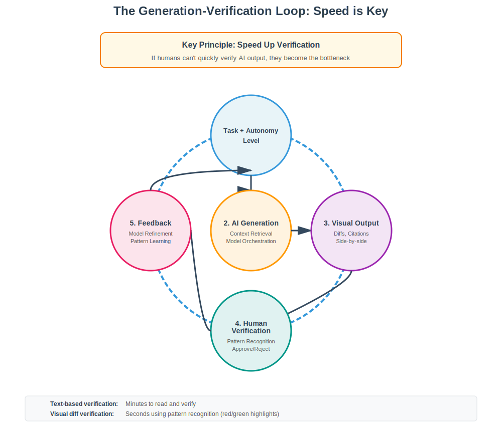
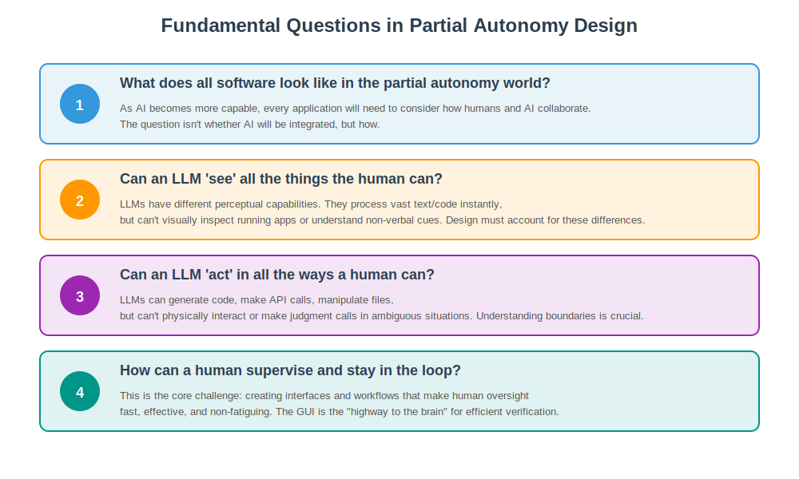
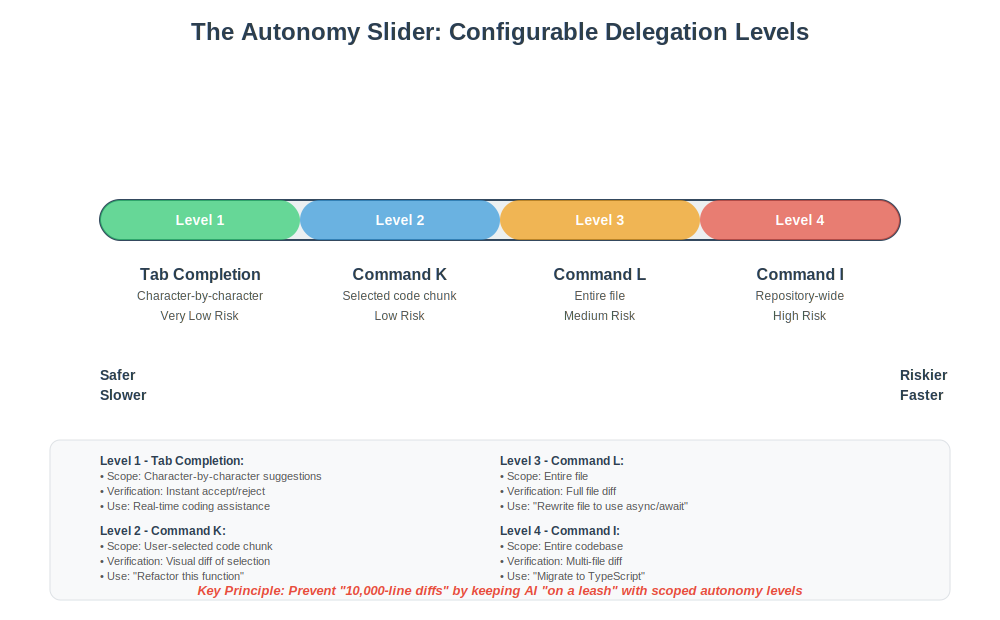
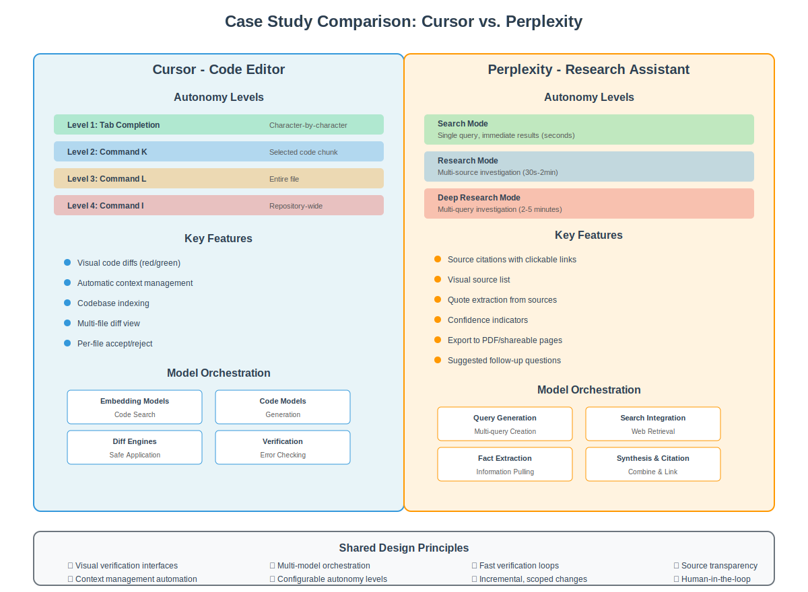
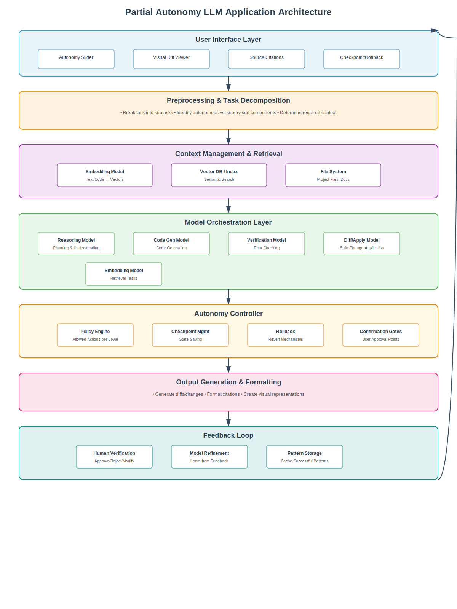
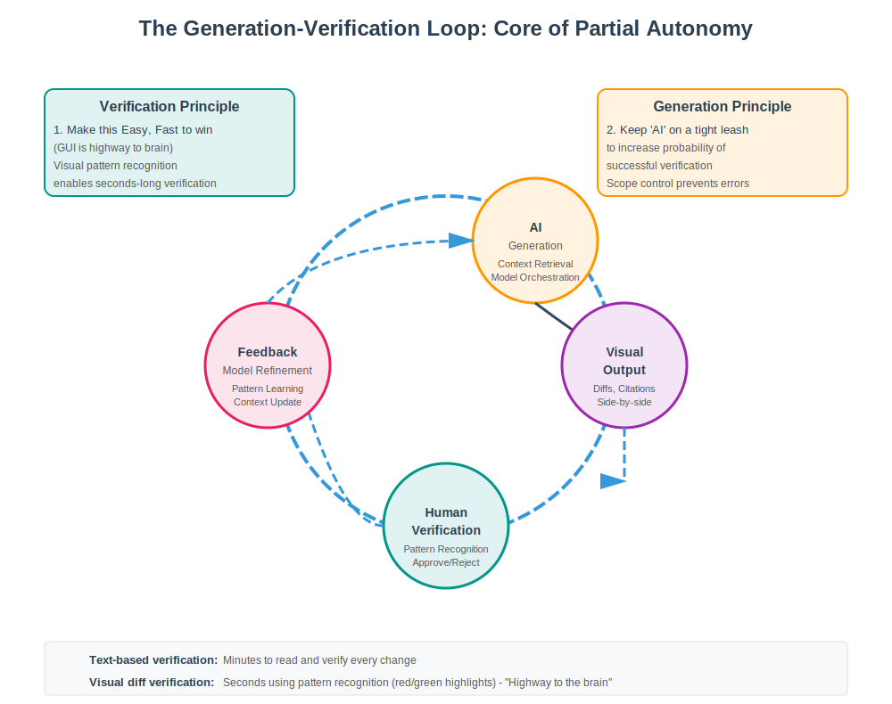
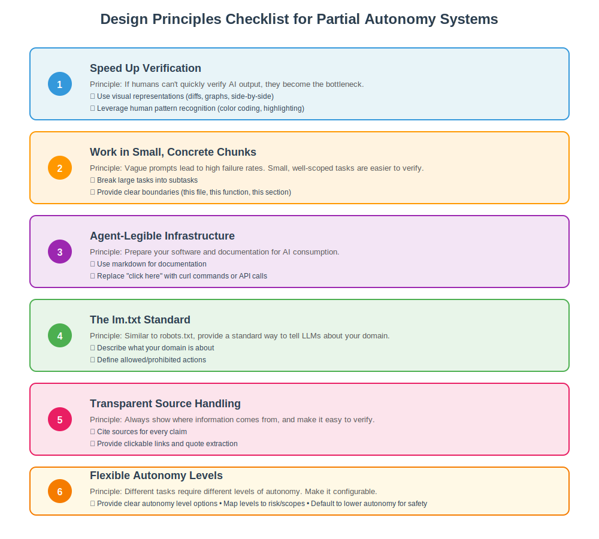

# Designing LLM Applications with Partial Autonomy: Building "Iron Man Suits" for Human Intelligence

*How to move beyond simple chat interfaces to create powerful, controllable AI tools that augment human capability*

---

## Introduction: Beyond the Chat Interface

The current generation of LLM applications often feels like talking to a very smart but unreliable assistant through a text box. You ask a question, get an answer, and hope it's correct. But what if we could build something more powerful—something that acts like an **"Iron Man suit"** for your brain, augmenting your capabilities while keeping you firmly in control?

This is the promise of **partial autonomy** in LLM applications: systems that can handle complex, multi-step tasks autonomously, but always maintain a fast **generation-verification loop** with human oversight. Instead of replacing humans, these systems amplify human intelligence by managing the cognitive deficits of LLMs—hallucinations, fixed memory, and context limitations—through thoughtful architectural design.


*The generation-verification loop: Speed is key. If humans can't quickly verify AI output, they become the bottleneck.*

### Fundamental Questions in Partial Autonomy Design

Before diving into solutions, we must address four critical questions that shape how we design these systems:


*Four fundamental questions that guide partial autonomy design.*

1. **"What does all software look like in the partial autonomy world?"**  
   As AI becomes more capable, every application will need to consider how humans and AI collaborate. The question isn't whether AI will be integrated, but *how*.

2. **"Can an LLM 'see' all the things the human can?"**  
   LLMs have different perceptual capabilities than humans. They can process vast amounts of text and code instantly, but they can't visually inspect a running application or understand non-verbal cues. Design must account for these differences.

3. **"Can an LLM 'act' in all the ways a human can?"**  
   LLMs can generate code, make API calls, and manipulate files, but they can't physically interact with systems or make judgment calls in ambiguous situations. Understanding these boundaries is crucial for safe autonomy.

4. **"How can a human supervise and stay in the loop?"**  
   This is the core challenge: creating interfaces and workflows that make human oversight fast, effective, and non-fatiguing.

In this deep dive, we'll explore:
- The core architectural principles of partial autonomy
- Real-world case studies (Cursor and Perplexity)
- System design patterns you can apply
- Best practices for building your own partially autonomous applications
- Answers to these fundamental questions through practical examples

---

## The Problem: Why Simple Chat Interfaces Fall Short

Before diving into solutions, let's understand the fundamental limitations of LLMs that make simple chat interfaces inadequate for complex tasks:

### 1. **Hallucinations**
LLMs can confidently produce incorrect information. Without verification mechanisms, users can't distinguish between accurate and fabricated outputs.

### 2. **Fixed Memory & Context Drift**
LLMs have limited context windows. In a chat interface, users must manually copy-paste relevant information, leading to context loss and inefficiency.

### 3. **Lack of Specialization**
A single model trying to do everything (reasoning, retrieval, code generation) performs worse than specialized models orchestrated together.

### 4. **Auditability Challenges**
Text-based outputs are difficult to verify. How do you quickly check if an AI-generated code change is correct? Or if a research answer cites real sources?

### 5. **All-or-Nothing Autonomy**
Most systems either require constant human input or operate completely autonomously. There's no middle ground for different risk levels.

---

## The Solution: Core Architectural Pillars

Effective partially autonomous LLM applications share several key architectural features. Let's break them down:

### 1. Context Management: Feeding the Model's "Working Memory"

**The Problem:** Users shouldn't have to manually copy-paste data into a chat window. The application should automatically manage what information the LLM sees.

**The Solution:** Implement intelligent context retrieval systems that:
- Use **embedding models** to find relevant files, documents, or code sections
- Dynamically load only what's needed for the current task
- Maintain context across multiple interactions
- Use vector databases or semantic search to retrieve relevant information

**Example:** When you ask Cursor to modify a function, it automatically loads the file, related imports, and relevant documentation—not just what you've manually pasted.

### 2. Orchestration of Multiple Specialized Models

**The Problem:** Using one model for everything leads to suboptimal performance.

**The Solution:** Orchestrate multiple specialized models:
- **Embedding models** for semantic search and retrieval
- **Chat/reasoning models** for understanding and planning
- **Code-specific models** for generation and modification
- **Diff models** for applying changes safely
- **Verification models** for cross-checking outputs

**Example:** Perplexity uses separate models for search query generation, web retrieval, fact extraction, and synthesis—each optimized for its specific task.

### 3. Application-Specific GUI: The "Highway to the Brain"

**The Problem:** Text-based interfaces make verification slow and error-prone. Humans process visual information much faster than text.

**The Solution:** Build dedicated GUIs that leverage human visual processing:
- **Visual diffs** (red/green code changes) for instant verification
- **Side-by-side comparisons** of before/after states
- **Source citations** with clickable links
- **Confidence indicators** and dispute flags
- **Checkpoint/rollback** mechanisms

**Why It Matters:** A developer can verify a code diff in seconds by scanning red/green highlights, but would take minutes reading through text descriptions of changes.

### 4. The Autonomy Slider: Configurable Delegation

**The Problem:** Different tasks require different levels of AI autonomy. High-risk tasks need more oversight; low-risk tasks can be more autonomous.

**The Solution:** Implement an **autonomy slider**—a UI control that lets users tune how much control they delegate to the AI:

```
Low Autonomy ←──────────────→ High Autonomy
(Safer, Slower)              (Faster, Riskier)
```

**Key Principle:** The autonomy level should map to the **scope** and **risk** of the task:
- **Low autonomy:** Small, localized changes (e.g., code completions)
- **Medium autonomy:** File-level modifications (e.g., refactoring a single file)
- **High autonomy:** Repository-wide changes (e.g., large-scale refactoring)


*The autonomy slider: Four levels of delegation from low-risk tab completion to high-risk repository-wide changes.*

---

## Case Study 1: Cursor - The Code Editor with Partial Autonomy

Cursor exemplifies partial autonomy in software development. Let's examine how it implements each architectural pillar:

### The Autonomy Slider: Four Distinct Levels

Cursor provides a granular autonomy slider with four distinct levels:

#### Level 1: Tab Completion
- **Scope:** Character-by-character suggestions
- **Risk:** Very low
- **Verification:** Instant (accept/reject inline)
- **Use Case:** Real-time coding assistance

#### Level 2: Command K (Selection-Based Editing)
- **Scope:** User-selected code chunk
- **Risk:** Low
- **Verification:** Visual diff of selected area
- **Use Case:** "Refactor this function" or "Add error handling here"

#### Level 3: Command L (File-Level Editing)
- **Scope:** Entire file
- **Risk:** Medium
- **Verification:** Full file diff with syntax highlighting
- **Use Case:** "Rewrite this file to use async/await" or "Add TypeScript types"

#### Level 4: Command I (Repository-Wide Agent Mode)
- **Scope:** Entire codebase
- **Risk:** High
- **Verification:** Multi-file diff view with ability to accept/reject per file
- **Use Case:** "Migrate from JavaScript to TypeScript" or "Add authentication to all endpoints"

### Why This Design Works

**Prevents "10,000-Line Diffs":** By keeping the AI "on a leash" with scoped autonomy levels, Cursor prevents the AI from generating massive, unverifiable changes. Users can incrementally increase autonomy as they build trust.


*Side-by-side comparison: How Cursor and Perplexity implement partial autonomy differently for coding vs. research.*

**Fast Verification Loop:** The visual diff interface allows developers to verify changes in seconds using pattern recognition rather than reading every line.

**Context Management:** Cursor automatically manages context by:
- Indexing the entire codebase
- Loading relevant files based on the task
- Understanding project structure and dependencies
- Maintaining conversation context across interactions

**Model Orchestration:** Under the hood, Cursor uses:
- Embedding models for code search
- Specialized code models for generation
- Diff engines for safe application
- Verification models for error checking

### Lessons Learned

1. **Start Small:** Users begin with tab completion and gradually increase autonomy as they gain confidence.
2. **Visual Verification is Key:** The red/green diff view is the "highway to the brain" that makes verification effortless.
3. **Scope Control:** Limiting the scope of changes prevents catastrophic errors and makes rollback easier.

---

## Case Study 2: Perplexity - Research with Partial Autonomy

Perplexity applies partial autonomy principles to information retrieval and research. Let's see how:

### The Autonomy Slider: Search → Research → Deep Research

Perplexity offers three main autonomy levels:

#### Search Mode (Quick Search)
- **Scope:** Single query, immediate results
- **Risk:** Low (user can verify sources quickly)
- **Time:** Seconds
- **Use Case:** "What is React?" or "Latest news on AI"
- **Autonomy Level:** Low - Quick responses with minimal processing

#### Research Mode
- **Scope:** Multi-source investigation with synthesis
- **Risk:** Low-Medium (multiple sources require verification)
- **Time:** 30 seconds - 2 minutes
- **Use Case:** "Explain how React hooks work" or "Compare TypeScript vs JavaScript"
- **Autonomy Level:** Medium - More thorough investigation with source synthesis

#### Deep Research Mode
- **Scope:** Multi-query investigation across hundreds of sources
- **Risk:** Medium (more sources = more verification needed)
- **Time:** 2-5 minutes
- **Use Case:** "Comprehensive analysis of quantum computing advances in 2024"
- **Follow-up Questions:** Perplexity suggests relevant follow-up questions to deepen the research, creating an interactive exploration experience
- **Autonomy Level:** Higher - Extensive investigation with iterative query refinement

### Architectural Implementation

**Auditability via GUI:**
- **Source Citations:** Every claim is linked to its source
- **Visual Source List:** Users can see all sources at a glance
- **Quote Extraction:** Direct quotes from sources are highlighted
- **Confidence Indicators:** Some facts are marked as disputed or uncertain

**Orchestration:**
- **Query Generation Model:** Creates multiple search queries from user question
- **Search Engine Integration:** Orchestrates dozens of searches
- **Fact Extraction Model:** Pulls relevant information from sources
- **Synthesis Model:** Combines information into coherent answer
- **Citation Model:** Links claims back to sources

**Context Management:**
- Maintains conversation history
- Remembers user preferences
- Tracks which sources have been used
- Builds on previous research sessions
- Suggests follow-up questions based on research findings

**Autonomy Levels:**
Perplexity's autonomy slider maps to different research depths:
- **Search:** Quick, single-query responses (low autonomy)
- **Research:** Multi-source investigation with synthesis (medium autonomy)
- **Deep Research:** Extensive multi-query investigation across hundreds of sources (higher autonomy, requires more time)

### Why This Design Works

**Transparency:** Users can verify every claim by clicking through to sources. This addresses the hallucination problem directly.

**Incremental Depth:** Users can start with quick search, escalate to research for more depth, and use deep research for comprehensive investigations when needed.

**Export & Share:** Research results can be exported as PDFs or shared pages, making them useful artifacts, not just ephemeral chat responses.

### Limitations & Mitigations

**Hallucinations Still Occur:** Even with citations, Perplexity can fabricate sources or misattribute quotes. The GUI makes it easier to catch these errors, but users must still verify.

**Time Trade-off:** Deep research takes minutes, not seconds. This is intentional—more thorough research requires more time.

---

## System Design: Architecture of a Partially Autonomous LLM Application

Let's break down the system architecture into concrete components:

### High-Level Architecture

```
┌─────────────────────────────────────────────────────────────┐
│                    User Interface Layer                      │
│  ┌──────────────┐  ┌──────────────┐  ┌──────────────┐      │
│  │ Autonomy     │  │ Visual Diff  │  │ Source       │      │
│  │ Slider       │  │ Viewer       │  │ Citations    │      │
│  └──────────────┘  └──────────────┘  └──────────────┘      │
└─────────────────────────────────────────────────────────────┘
                            │
                            ▼
┌─────────────────────────────────────────────────────────────┐
│              Preprocessing & Task Decomposition              │
│  • Break task into subtasks                                  │
│  • Identify autonomous vs. supervised components             │
│  • Determine required context                                │
└─────────────────────────────────────────────────────────────┘
                            │
                            ▼
┌─────────────────────────────────────────────────────────────┐
│              Context Management & Retrieval                  │
│  ┌──────────────┐  ┌──────────────┐  ┌──────────────┐      │
│  │ Embedding    │  │ Vector DB    │  │ File         │      │
│  │ Model        │  │ / Index      │  │ System       │      │
│  └──────────────┘  └──────────────┘  └──────────────┘      │
└─────────────────────────────────────────────────────────────┘
                            │
                            ▼
┌─────────────────────────────────────────────────────────────┐
│              Model Orchestration Layer                       │
│  ┌──────────────┐  ┌──────────────┐  ┌──────────────┐      │
│  │ Reasoning    │  │ Code Gen     │  │ Verification │      │
│  │ Model        │  │ Model        │  │ Model        │      │
│  └──────────────┘  └──────────────┘  └──────────────┘      │
│  ┌──────────────┐  ┌──────────────┐                        │
│  │ Embedding    │  │ Diff/Apply   │                        │
│  │ Model        │  │ Model        │                        │
│  └──────────────┘  └──────────────┘                        │
└─────────────────────────────────────────────────────────────┘
                            │
                            ▼
┌─────────────────────────────────────────────────────────────┐
│              Autonomy Controller                             │
│  • Policy engine (what's allowed per autonomy level)        │
│  • Checkpoint management                                    │
│  • Rollback mechanisms                                      │
│  • User confirmation gates                                  │
└─────────────────────────────────────────────────────────────┘
                            │
                            ▼
┌─────────────────────────────────────────────────────────────┐
│              Output Generation & Formatting                  │
│  • Generate diffs/changes                                   │
│  • Format citations                                         │
│  • Create visual representations                            │
└─────────────────────────────────────────────────────────────┘
                            │
                            ▼
┌─────────────────────────────────────────────────────────────┐
│              Feedback Loop                                   │
│  • Human verification                                       │
│  • Approval/rejection/modification                          │
│  • Model refinement based on feedback                       │
│  • Learning from corrections                                │
└─────────────────────────────────────────────────────────────┘
```


*Complete system architecture: From user interface to feedback loop, showing how all components work together.*

### Component Details

#### 1. User Interface Layer
- **Autonomy Slider:** UI control for selecting autonomy level
- **Visual Diff Viewer:** Side-by-side or inline diff visualization
- **Source Citations:** Clickable links to sources with quote extraction
- **Confidence Indicators:** Visual markers for uncertainty
- **Checkpoint/Rollback:** Ability to revert to previous states

#### 2. Preprocessing & Task Decomposition
- Breaks complex tasks into smaller, verifiable subtasks
- Identifies which parts can be autonomous vs. require human oversight
- Determines what context is needed for each subtask

#### 3. Context Management & Retrieval
- **Embedding Model:** Converts text/code into vector representations
- **Vector Database:** Stores and retrieves relevant context
- **File System Integration:** Accesses project files, documentation, etc.
- **Semantic Search:** Finds relevant information based on meaning, not keywords

#### 4. Model Orchestration Layer
- **Reasoning Model:** Understands tasks and creates plans
- **Code Generation Model:** Specialized for code generation
- **Verification Model:** Checks outputs for errors or inconsistencies
- **Embedding Model:** For retrieval tasks
- **Diff/Apply Model:** Safely applies changes to codebase

#### 5. Autonomy Controller
- **Policy Engine:** Defines what actions are allowed at each autonomy level
- **Checkpoint Management:** Saves states for rollback
- **User Confirmation Gates:** Pauses for approval at critical points
- **Scope Limiting:** Enforces boundaries (file, directory, repository)

#### 6. Feedback Loop
- Captures user approvals/rejections
- Learns from corrections
- Refines future outputs
- Stores successful patterns for reuse

---

## Design Principles: Building Your Own Partial Autonomy System

Based on the case studies and architectural analysis, here are key principles to follow:

### 1. Speed Up Verification: The "Highway to the Brain"

**Principle:** If humans can't quickly verify AI output, they become the bottleneck. The GUI is the "highway to the brain"—it's how information flows efficiently from AI to human understanding.

**The Generation-Verification Loop:**
The core workflow is a continuous loop:
1. **AI Generation** → Context retrieval, model orchestration, output creation
2. **Visual Output** → Diffs, citations, side-by-side comparisons
3. **Human Verification** → Pattern recognition, approve/reject/modify
4. **Feedback** → Model refinement, pattern learning
5. **Loop Continues** → Back to generation with improved context


*Detailed view of the generation-verification loop with key principles: Make verification easy and fast (GUI is highway to brain), and keep AI on a tight leash.*

**Key Insight:** Keep AI "on a tight leash" to increase the probability of successful verification. By limiting scope and autonomy, you reduce the cognitive load on humans and make verification faster.

**Implementation:**
- Use visual representations (diffs, graphs, side-by-side comparisons)
- Leverage human pattern recognition (color coding, highlighting)
- Provide clear "before/after" states
- Make verification actions (approve/reject) one-click
- Design for fast pattern matching, not slow reading

**Example:** A code diff with red/green highlighting can be verified in seconds using visual pattern recognition. A text description of changes would take minutes of careful reading.

### 2. Work in Small, Concrete Chunks

**Principle:** Vague prompts lead to high failure rates. Small, well-scoped tasks are easier to verify and correct.

**Implementation:**
- Break large tasks into subtasks
- Provide clear boundaries (this file, this function, this section)
- Use incremental progress indicators
- Allow users to approve/reject per chunk

**Example:** Instead of "refactor the entire codebase," use "refactor this function to use async/await" → "refactor this file" → "refactor this module."

### 3. Agent-Legible Infrastructure

**Principle:** Prepare your software and documentation for AI consumption.

**Implementation:**
- Use **markdown** for documentation (LLMs parse it easily)
- Replace "click here" instructions with **curl commands** or API calls
- Structure data in JSON or other parseable formats
- Provide clear, machine-readable APIs

**Example:** Instead of "Go to Settings → Preferences → Editor," provide: `curl -X PUT /api/settings/editor/preferences`

### 4. The `lm.txt` Standard (Emerging Practice)

**Principle:** Similar to `robots.txt`, provide a standard way to tell LLMs about your domain. **Note:** This is an emerging idea, not yet a widely adopted standard, but represents an important direction for agent-legible infrastructure.

**Current Status:** The `lm.txt` concept (also sometimes called `llms.txt`) is being discussed in the community but has not been officially adopted by major LLM providers. However, the principle of making domains more legible to AI agents is gaining traction, especially with protocols like MCP (Model Context Protocol).

**Implementation:**
- Create `lm.txt` files that describe:
  - What the domain/application is about
  - What actions are allowed/prohibited
  - Key concepts and terminology
  - Preferred data formats
  - Available APIs and tools
- Keep it lightweight and parseable
- Version control it alongside your code
- Consider it a "map" for AI agents, similar to how `robots.txt` guides web crawlers

**Example `lm.txt`:**
```
# My Application Domain

## Purpose
This is a financial trading application. LLMs should not execute trades autonomously.

## Allowed Actions
- Read market data
- Generate analysis reports
- Suggest trading strategies (with human approval)

## Prohibited Actions
- Execute trades
- Modify account settings
- Access user credentials

## Key Concepts
- Portfolio: Collection of investments
- Position: Individual holding in a security
- Risk: Measured in standard deviations

## Available Tools/APIs
- GET /api/market/data/{symbol} - Retrieve market data
- POST /api/analysis/generate - Generate analysis (requires approval)
```

**Related:** The **Model Context Protocol (MCP)** introduced by Anthropic in late 2024 provides a standardized way for applications to provide context to LLMs, enabling dynamic tool discovery and selection—a crucial enabler for partial autonomy systems.

### 5. Transparent Source Handling

**Principle:** Always show where information comes from, and make it easy to verify.

**Implementation:**
- Cite sources for every claim
- Provide clickable links
- Extract relevant quotes
- Indicate confidence levels
- Flag disputed or uncertain information

### 6. Flexible Autonomy Levels

**Principle:** Different tasks require different levels of autonomy. Make it configurable.

**Implementation:**
- Provide clear autonomy level options
- Map levels to risk/scopes
- Allow users to change levels mid-task
- Default to lower autonomy for safety


*Visual checklist of key design principles for building effective partial autonomy systems.*

---

## Handling Failures: When Things Go Wrong

Even well-designed systems fail. Here's how to handle common failure modes:

### Hallucinations

**Problem:** LLMs generate plausible-sounding but incorrect information.

**Mitigation:**
- Always require source citations
- Use verification models to cross-check facts
- Compare multiple sources
- Flag low-confidence claims
- Make it easy for users to verify sources

### Scope Creep

**Problem:** AI makes changes beyond the intended scope.

**Mitigation:**
- Enforce strict boundaries per autonomy level
- Require explicit approval for scope expansion
- Use file-level or directory-level permissions
- Provide clear rollback mechanisms

### Context Loss

**Problem:** LLM loses track of conversation or project context. This is especially problematic across sessions—agents forgetting project state, requiring repeated explanations, or losing track of earlier decisions.

**Mitigation:**
- Maintain explicit context windows with smart pruning
- Use retrieval-augmented generation (RAG) for long-term memory
- Store conversation history and project state persistently
- Provide context summary views
- Implement memory management policies (e.g., MemTool-style adaptive memory)
- Use vector databases to maintain semantic context across sessions
- Create "checkpoints" that capture important project state

**Real-World Impact:** Users report frustration when Cursor forgets earlier decisions or requires re-explaining project structure. This highlights the importance of persistent, well-managed context.

### Verification Fatigue

**Problem:** Users get tired of verifying every small change.

**Mitigation:**
- Start with low autonomy (less to verify)
- Use batch approval for similar changes
- Learn from user patterns (approve similar changes automatically)
- Provide "trust this pattern" options
- Gradually increase autonomy as trust builds

### Cost and Complexity Trade-offs

**Problem:** While tools like Cursor speed up development velocity in the short term, they can lead to increased code complexity and technical debt over time.

**Research Finding:** Studies show that Cursor adoption leads to faster development but also persistent increases in code complexity and static analysis warnings. The speed gain comes with a quality cost.

**Mitigation:**
- Maintain code review processes even with AI assistance
- Use static analysis tools to catch complexity increases
- Set complexity budgets and monitor them
- Balance speed with maintainability
- Don't let AI autonomy override code quality standards

### DevOps and Deployment Challenges

**Problem:** "You can code in 1 day but it takes 7 days to deploy." Partial autonomy systems can generate code quickly, but deployment, testing, and integration still require human oversight and time.

**Mitigation:**
- Design systems that understand deployment pipelines
- Create "agent-legible" CI/CD configurations
- Use `lm.txt` or similar standards to describe deployment constraints
- Build deployment verification into the autonomy controller
- Consider deployment risk when setting autonomy levels
- Automate testing and validation as part of the generation loop

---

## Future Directions

The field of partial autonomy is rapidly evolving. Here are emerging trends:

### 1. Temporal Memory and Context Persistence
Systems that remember past interactions and learn from them, reducing the need for repeated context. Tools like MemTool demonstrate adaptive memory management that balances autonomy with deterministic control.

### 2. Better Context Management
More sophisticated retrieval systems that understand relationships between pieces of information. Context pruning policies that intelligently manage what stays in memory vs. what gets archived.

### 3. Standardization: MCP and Beyond
The Model Context Protocol (MCP) is gaining adoption as a standard for how applications provide context to LLMs. This enables dynamic tool discovery and reduces brittleness in agent systems. The `lm.txt` concept may evolve into a more formal standard.

### 4. Hybrid Models and Specialized Orchestration
Combining specialized models more seamlessly, with automatic model selection based on task. Prompt routing systems that send queries to specialized modules (technical support, summarization, code patches) improve accuracy.

### 5. Improved Safety Mechanisms
Better verification models, automated testing of AI outputs, and more robust rollback systems. Frameworks like AgentSpec provide DSLs for enforcing runtime safety constraints, dramatically reducing unsafe behavior.

### 6. Domain-Specific Autonomy Sliders
Custom autonomy levels tailored to specific domains (e.g., medical diagnosis vs. code refactoring). Different risk profiles require different autonomy configurations.

### 7. Experience-Based Learning
Systems where agents store "lessons" from past trajectories and refine policies or heuristics through closed-loop feedback, improving autonomy over time.

### 8. Cost and Latency Optimization
Techniques like paged attention for KV cache management, dynamic batching, and quantization help scale partial autonomy systems while managing costs.

---

## Conclusion: Key Takeaways

Designing LLM applications with partial autonomy requires a shift in mindset:

1. **Think Beyond Chat:** Move from simple Q&A interfaces to dedicated tools that augment human capability.

2. **Manage Cognitive Deficits:** Use architecture (context management, model orchestration, GUIs) to compensate for LLM weaknesses.

3. **Keep Humans in Control:** The autonomy slider isn't just a feature—it's a fundamental design pattern for human-AI collaboration.

4. **Speed Up Verification:** If verification is slow, humans become the bottleneck. Use visual interfaces and small chunks.

5. **Build for AI Consumption:** Structure your systems and documentation so AI agents can understand and interact with them.

6. **Start Small, Scale Up:** Begin with low autonomy and let users increase it as they build trust.

The future of LLM applications isn't full autonomy—it's **intelligent augmentation** with **human oversight**. By designing systems that respect both AI capabilities and human judgment, we can create tools that truly amplify human intelligence.

---

## Resources & Further Reading

### Tools & Platforms
- **Cursor Documentation:** [cursor.sh](https://cursor.sh)
- **Perplexity Deep Research:** [perplexity.ai](https://www.perplexity.ai)
- **Model Context Protocol (MCP):** [Anthropic MCP Documentation](https://modelcontextprotocol.io)

### Research Papers
- **Archon: Architecture Search Framework:** [arXiv:2409.15254](https://arxiv.org/abs/2409.15254)
- **MegaAgent: Autonomous Cooperation:** [arXiv:2408.09955](https://arxiv.org/abs/2408.09955)
- **Control Plane as a Tool:** [arXiv:2505.06817](https://arxiv.org/abs/2505.06817)
- **AgentSpec: Runtime Safety Constraints:** [arXiv:2503.18666](https://arxiv.org/abs/2503.18666)
- **Tool-RoCo: Benchmark for Autonomous Agents:** [arXiv:2511.21510](https://arxiv.org/abs/2511.21510)
- **MemTool: Adaptive Memory Management:** [arXiv:2507.21428](https://arxiv.org/abs/2507.21428)
- **Cost vs Quality Trade-offs in AI-Assisted Development:** [arXiv:2511.04427](https://arxiv.org/abs/2511.04427)

### Standards & Protocols
- **llms.txt Standard Discussion:** Emerging standard for AI-readable domain descriptions
- **Model Context Protocol:** Standardized context provision for LLMs

---

*This blog post is based on research and analysis of current LLM application design patterns. For the latest updates and discussions, follow me on LinkedIn.*
